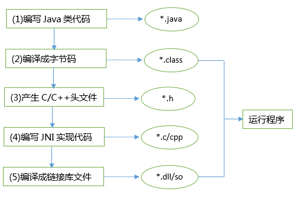

## JNA实战笔记汇总<一> 简单认识JNA|成功调用JNA

### 一、简介

先说JNI(Java Native Interface)吧，有过不同语言间通信经历的一般都知道，它允许Java代码和其他语言（尤其C/C++）写的代码进行交互，只要遵守调用约定即可。首先看下JNI调用C/C++的过程，注意写程序时自下而上，调用时自上而下。



可 见步骤非常的多，很麻烦，使用JNI调用.dll/.so共享库都能体会到这个痛苦的过程。如果已有一个编译好的.dll/.so文件，如果使用JNI技 术调用，我们首先需要使用C语言另外写一个.dll/.so共享库，使用SUN规定的数据结构替代C语言的数据结构，调用已有的 dll/so中公布的函 数。然后再在Java中载入这个库dll/so，最后编写Java  native函数作为链接库中函数的代理。经过这些繁琐的步骤才能在Java中调用 本地代码。因此，很少有Java程序员愿意编写调用dll/.so库中原生函数的java程序。这也使Java语言在客户端上乏善可陈，可以说JNI是 Java的一大弱点！

那么JNA是什么呢？

JNA(Java Native Access)框架是一个开源的Java框架，是SUN公司主导开发的，建立在经典的JNI的基础之上的一个框架。使用JNI调用共享类库（.dll/.so文件）是非常麻烦的事情，既需要编写java代码，又要编写C语言的代理方法，这其中需要很多数据类型的转换，是让人非常头痛。JNA框架就是为了解决这些问题和繁琐的事情而开发的，它提供一组Java工具类用于在运行期动态访问系统本地共享类库而不需要编写任何Native/JNI代码。开发人员只要在一个java接口中描述目标native library的函数与结构，JNA将自动实现Java接口到native function的映射，大大降低了Java调用本体共享库的开发难度。JNA与.NET平台上的P/Invoke机制一样简单和方便。
之所以说它是JNI的替 代者，是因为JNA大大简化了调用本地方法的过程，使用很方便，基本上不需要脱离Java环境就可以完成。

如果要和上图做个比较，那么JNA调用C/C++的过程大致如下：


可以看到步骤减少了很多，最重要的是我们不需要重写我们的动态链接库文件，而是有直接调用的API，大大简化了我们的工作量。

JNA只需要我们写Java代码而不用写JNI或本地代码。功能相对于Windows的Platform/Invoke和Python的ctypes。


### 二、原理

JNA使用一个小型的JNI库插桩程序来动态调用本地代码。开发者使用Java接口描述目标本地库的功能和结构，这使得它很容易利用本机平台的功能，而不会产生多平台配置和生成JNI代码的高开销。这样的性能、准确性和易用性显然受到很大的重视。

此外，JNA包括一个已与许多本地函数映射的平台库，以及一组简化本地访问的公用接口。

注意：

JNA是建立在JNI技术基础之上的一个Java类库，它使您可以方便地使用java直接访问动态链接库中的函数。

原来使用JNI，你必须手工用C写一个动态链接库，在C语言中映射Java的数据类型。

JNA中，它提供了一个动态的C语言编写的转发器，可以自动实现Java和C的数据类型映射，你不再需要编写C动态链接库。

也许这也意味着，使用JNA技术比使用JNI技术调用动态链接库会有些微的性能损失。但总体影响不大，因为JNA也避免了JNI的一些平台配置的开销。

### 三、相关jna.jar包和.so库文件的下载

JNA的项目是放在[Github上面的](https://github.com/java-native-access/jna)，目前最新版本是4.4.0，已有打包好的jar文件可供下载。
我这里使用的是4.2.1版本的，并提供了可以直接使用的jar包和.so库文件，[JNA开发的jna.jar以及.so库文件](http://download.csdn.net/download/abc6368765/9963681)，

### 四、配置环境，编译sayhello.so库文件

1、在app下面建立一個jni文件夾，添加库函数文件sayhello.c：

```C
#include "sayhello.h"

int sayHello(){
    printf("Hello World!");
    return 1;
}

```

以及头文件sayhello.h：

```C
#include <stdio.h>
int sayHello();
```

2、其他就是配置我们编译C/C++代码的环境了，如果不懂可以参考这篇文章：[NDK学习笔记<一> 初步认识JNI|成功搭建NDK开发环境](http://blog.csdn.net/abc6368765/article/details/64438213)

3、成功配置我们的C/C++编译环境后，在lib目录下面成功编译出我们需要的.so文件。然后把jna.jar和相关的.so文件添加到项目中

4、接着我们在src目录下面添加jniLibs文件夹：把JNA的libjnidispatch.so.so库文件和我们生成的libsayhello.so库文件全部添加合并到jniLibs
文件夹下面，并配置我们的build.gradle文件,添加jniLibs.srcDirs = ['src/main/jniLibs']：

```gradle
android {
    compileSdkVersion 25
    buildToolsVersion "26.0.1"

    defaultConfig {
        applicationId "com.afinalstone.androidstudy.myjna_01"
        minSdkVersion 16
        targetSdkVersion 25
        versionCode 1
        versionName "1.0"

        testInstrumentationRunner "android.support.test.runner.AndroidJUnitRunner"

    }
    buildTypes {
        release {
            minifyEnabled false
            proguardFiles getDefaultProguardFile('proguard-android.txt'), 'proguard-rules.pro'
        }
    }
    sourceSets {
        main {
            jniLibs.srcDirs = ['src/main/jniLibs']
        }
    }
}

dependencies {
    compile fileTree(include: ['*.jar'], dir: 'libs')
    compile 'com.android.support:appcompat-v7:25.3.1'
    compile 'com.android.support.constraint:constraint-layout:1.0.2'
}
```

### 五、创建Library，成功实现Java调用C/C++函数代码库

创建一个Clibrary对象：

```
package com.afinalstone.androidstudy.myjna_01;

import com.sun.jna.Library;
import com.sun.jna.Native;
import com.sun.jna.Pointer;
import com.sun.jna.ptr.IntByReference;
import com.sun.jna.ptr.PointerByReference;

//继承Library，用于加载库文件
public interface Clibrary extends Library {
    //加载libhello.so链接库
    Clibrary INSTANTCE = (Clibrary) Native.loadLibrary("sayhello", Clibrary.class);
    //此方法为链接库中的方法

    int sayHello();
}
```

1、定义接口对象。

在上面的代码中，我们定义了一个接口，继承自Library 或StdCallLibrary，默认的是继承Library ，
如果动态链接库里的函数是以stdcall方式输出的，那么就继承StdCallLibrary，比如众所周知的kernel32库。

2、接口内部定义

接口内部需要一个公共静态常量：INSTANCE，通过这个常量，就可以获得这个接口的实例，从而使用接口的方法，也就是调用外部dll/so的函数。 
该常量通过Native.loadLibrary()这个API函数获得，该函数有2个参数：
  
- 第一个参数是动态链接库dll/so的名称，但不带.dll或.so这样的后缀，这符合JNI的规范，因为带了后缀名就不可以跨操作系统平台了。搜索动态链 接库路径的顺序是：先从当前类的当前文件夹找，如果没有找到，再在工程当前文件夹下面找win32/win64文件夹，找到后搜索对应的dll文件，如果 找不到再到WINDOWS下面去搜索，再找不到就会抛异常了。比如上例中printf函数在Windows平台下所在的dll库名称是msvcrt，而在 其它平台如Linux下的so库名称是c。

- 第二个参数是本接口的Class类型。JNA通过这个Class类型，根据指定的.dll/.so文件，动态创建接口的实例。该实例由JNA通过反射自动生成。
然后在MainActivity中调用sayHello方法：

接口中只需要定义你要用到的函数或者公共变量，不需要的可以不定义，注意参数和返回值的类型，应该和链接库中的函数类型保持一致。

定义好接口后，就可以使用接口中的函数即相应dll/so中的函数了

### 六、调用C++函数代码

定义好接口后，就可以使用接口中的函数即相应函数库中的函数了，这里我们在MainActivity中响应点击事件调用C++函数代码，并打印出结果：

```java

package com.afinalstone.androidstudy.myjna_01;

import android.os.Bundle;
import android.support.v7.app.AppCompatActivity;
import android.util.Log;
import android.view.View;

public class MainActivity extends AppCompatActivity {

    @Override
    protected void onCreate(Bundle savedInstanceState) {
        super.onCreate(savedInstanceState);
        setContentView(R.layout.activity_main);

    }

    //按钮点击事件
    public void onClick(View view){
        int result = Clibrary.INSTANTCE.sayHello();
        Log.d("MainActivity","sayHello的放回结果:"+result);
    }

}

```

到这里位置，如果成功运行项目，整个项目结构以及结果基本是这样的：


### 七、避免错误的建议：

1.要注意我们生成的库文件都是lib**.so，但是我们在加载.so库文件的时候是不需要lib前缀的。

2.要检查build.gradle中是否指定了.so库文件的地址，在这里我之所以吧所有的.so库文件都放在了jniLibs文件夹中，
是因为我在build.gradle中指定了 jniLibs.srcDirs = ['src/main/jniLibs']

3.可以解压成功编译的apk，查看该apk的lib目录下面是否有libsayhello.so和libjnidispatch.so两个库文件。

4.项目中偶时候需要用到Java调用c++函数代码，但是始终出错，主要错误原因是undefined symbol，找不到c++ 方法。
需要我们使用extern "C" 给C++代码做标记，否则无法找到。

```C++
#include <stdlib.h>  
#include <iostream>  
using namespace std;  
  
extern "C"  
{  
    void test() {  
         cout << "TEST" << endl;  
    }  
  
    int addTest(int a,int b)  
    {  
      int c = a + b ;  
      return c ;  
    }   
}  
```
