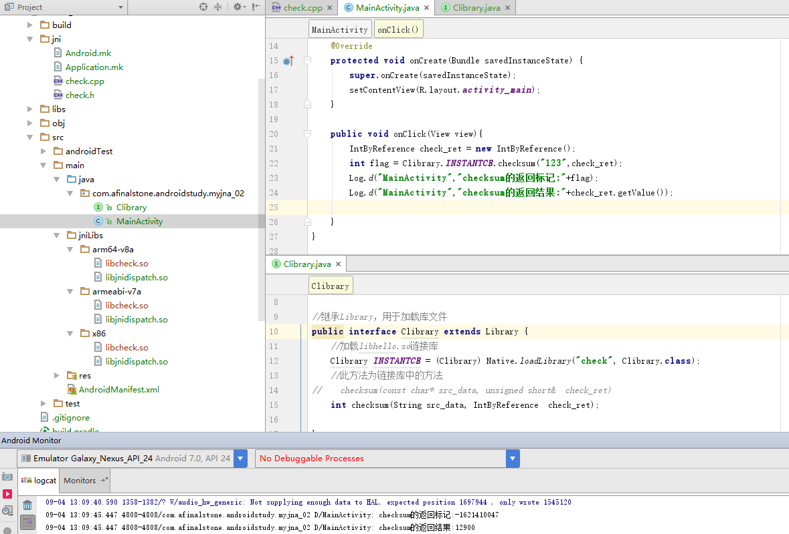

## JNA实战笔记汇总<二> JNA和C/C++的数据类型转换

### 一、JNA技术的难点

上篇文章我们成功实现了Java使用JNA调用C/C++的函数代码：

```C
int sayHello(){
    printf("Hello World!");
    return 1;
}
```

上面的代码非常简单，在控制台打印输入"Hello World"，并返回整数型。然后我们在CLibrary中也是定义了一个对应的函数

```
int sayHello();
```

由于C/C++语言和Java语言中的int类型对应，所以这里并没有复杂的类型转换，也就大大降低了调用JNA和C/C++代码对接的难度。

有过跨语言、跨平台开发的程序员都知道，跨平台、语言调用的难点，就是不同语言之间数据类型不一致造成的问题。绝大部分跨平台调用的失败，都是这个问题造成的。关于这一点，不论何种语言，何种技术方案，都无法解决这个问题。JNA也不例外。

上面说到接口中使用的函数必须与链接库中的函数原型保持一致，这是JNA甚至所有跨平台调用的难点，因为C/C++的类型与Java的类型是不一样的，你必须转换类型让它们保持一致，比如printf函数在C中的原型为：

```
void printf(const char *format, [argument]);
```

你不可能在Java中也这么写，Java中是没有char *指针类型的，因此const char * 转到Java下就是String类型了。

### 二、JNA的常用类型映射（Type Mappings）如下：

| Native Type|Java Type | 	Native Representation | 
|:------:|:------:|:------:|
| char  | byte | 8-bit integer   | 
| wchar_t  | char | 16/32-bit character|
| short | short |  16-bit integer  | 
|int |  int  |32-bit integer |  
| int |boolean | 32-bit integer (customizable) | 
|  long, __int64 |  long |64-bit integer |
| long long |long  | 64-bit integer  |  
| float  |  float    | 32-bit FP  |  
| double |  double   | 64-bit FP   |  
| pointer |  Buffer/Pointer |
| pointer array |  [] (array of primitive type)|
| char* |  String  | 
| wchar_t* |  WString  | 
| char** |  String[]  | 
| wchar_t** | WString[] | 
|  void* |  Pointer  | 
|  void ** | PointerByReference  | 
|  int& | IntByReference  | 
|  int* |  IntByReference  | 
|  struct|  Structure    | 
|  (*fp)()|  Callback   | 
| varies |  NativeMapped    | 
| long |  NativeLong    | 
| pointer |  PointerType    | 

#### 附带一个很重要的API接口文档地址：[传送门](http://java-native-access.github.io/jna/4.4.0/javadoc/)

### 三、具体实例

接下来我们写一个复杂一点的C++函数

```
bool checksum(const char* src_data, unsigned short&  check_ret)
```

然后在Java中调用该方法，传入具体参数，并获取到返回值。

#### 1、首先是check.h文件和check.cpp文件：

- check.h

```h
#ifndef TASK_CHECKSUM_H
#define TASK_CHECKSUM_H

typedef signed char int8_t;
typedef short int  int16_t;
typedef int        int32_t;


/* --------------------------------------------------------------------------*/
/**
 * @Synopsis          checksum加密算法
 *
 * @Param src_data    被加密的字符串 
 *
 * @Param check_ret   int16_t类型的加密结果
 *
 * @Returns           加密是否成功
 */
/* ----------------------------------------------------------------------------*/

extern "C" bool checksum(const char* src_data, unsigned short& check_ret);

#endif
```

- check.cpp

```C
#include "check.h"
#include <string.h>
extern "C"{

bool checksum(const char* src_data, unsigned short&  check_ret) {
    bool ret = true;

    do {
        const int16_t* opt_data = reinterpret_cast<const int16_t*>(src_data);
        if (opt_data == NULL || src_data == NULL) {
            ret = false;
            /*TODO*/
            // warn_log();
            break;
        }
        int32_t accu_sum = 0;
        int32_t data_len = strlen(src_data);

        while (data_len > 1) {
            accu_sum += *(opt_data);
            opt_data++;
            data_len = data_len - 2;

            if (accu_sum & 0x80000000) {
                accu_sum = (accu_sum >> 16) + (accu_sum & 0xFFFF);
            }
        }

        if (data_len == 1) {
            accu_sum += *(reinterpret_cast<const int8_t*>(opt_data));
        }

        while (accu_sum >> 16) {
            accu_sum = (accu_sum >> 16) + (accu_sum & 0xFFFF);
        }
        check_ret = 0xFFFF & accu_sum;
        
//        check_ret = (accu_sum == 0xFFFF)?~accu_sum:accu_sum;

//        check_ret = (accu_sum == 0xFFFF)?accu_sum:~accu_sum;
    }while(0);

    return ret;
}
}

```

上述代码中checksum函数需要用户传入一个char*指针类型的参数src_data和一个short&引用类型的check_ret，代码对stc_data进行
加密操作之后，把加密结果返回到参数check_ret中，函数返回加密是否成功的标记。由于代码中使用了string，bool等和C++相关的元素，
所以我们的文件后缀一定要使用.cpp，并且在整个函数外部使用了 extern "C" 给C++代码做标记，否则在Java调用该方法的时候会提示无法找到。

#### 2、然后是CLibrary对象和MainActivity对象

编写完毕代码，使用Ndk-build命令行进行编译，成功生成libcheck.so文件，配置完毕JNA的相关jar包和库文件，把他们添加到已经准备好的jniLibs文件夹中，然后创建按一个CLibrary类：

```C++
//继承Library，用于加载库文件
public interface Clibrary extends Library {
    //加载libhello.so链接库
    Clibrary INSTANTCE = (Clibrary) Native.loadLibrary("check", Clibrary.class);
    //此方法为链接库中的方法
//    checksum(const char* src_data, unsigned short&  check_ret)
    int checksum(String src_data, IntByReference  check_ret);
}
```

MainActivity

```java
package com.afinalstone.androidstudy.myjna_02;

import android.support.v7.app.AppCompatActivity;
import android.os.Bundle;
import android.util.Log;
import android.view.View;

import com.sun.jna.Pointer;
import com.sun.jna.ptr.IntByReference;
import com.sun.jna.ptr.PointerByReference;

public class MainActivity extends AppCompatActivity {

    @Override
    protected void onCreate(Bundle savedInstanceState) {
        super.onCreate(savedInstanceState);
        setContentView(R.layout.activity_main);
    }

    public void onClick(View view){
        IntByReference check_ret = new IntByReference();
        int flag = Clibrary.INSTANTCE.checksum("123",check_ret);
        Log.d("MainActivity","checksum的返回标记:"+flag);
        Log.d("MainActivity","checksum的返回结果:"+check_ret.getValue());

    }
}

```

代码定义了一个点击事件，点击按钮调用  int flag = Clibrary.INSTANTCE.checksum("123",check_ret),并输出checksum的返回标记和加密结果。


