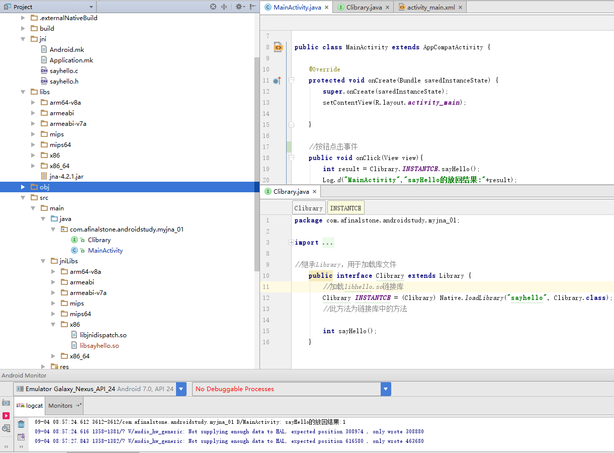

## JNA实战笔记汇总<一> 简单认识JNA|成功调用JNA

#### 简介：

JNA(Java Native Access)框架是一个开源的Java框架，是SUN公司主导开发的，建立在经典的JNI的基础之上的一个框架。使用JNI调用共享类库（.dll/.so文件）是非常麻烦的事情，既需要编写java代码，又要编写C语言的代理方法，这其中需要很多数据类型的转换，是让人非常头痛。JNA框架就是为了解决这些问题和繁琐的事情而开发的，它提供一组Java工具类用于在运行期动态访问系统本地共享类库而不需要编写任何Native/JNI代码。开发人员只要在一个java接口中描述目标native library的函数与结构，JNA将自动实现Java接口到native function的映射，大大降低了Java调用本体共享库的开发难度。JNA与.NET平台上的P/Invoke机制一样简单和方便。

#### 配置环境，编译sayhello.so库文件

1、在app下面建立一個jni文件夾，添加库函数文件sayhello.c：

```C
#include "sayhello.h"

int sayHello(){
    printf("Hello World!");
    return 1;
}

```

以及头文件sayhello.h：

```C
#include <stdio.h>
int sayHello();
```

2、其他就是配置我们编译C/C++代码的环境了，如果不懂可以参考这篇文章：[NDK学习笔记<一> 初步认识JNI|成功搭建NDK开发环境](http://blog.csdn.net/abc6368765/article/details/64438213)

3、成功配置我们的C/C++编译环境后，在lib目录下面成功编译出我们需要的.so文件。然后把jna.jar和相关的.so文件添加到项目
中，和JNA相关的jna.jar和.so库文件可以在这里下载：[JNA开发的jna.jar以及.so库文件](http://download.csdn.net/download/abc6368765/9963681)
以及附带上JNA的项目地址：[传送门](https://github.com/twall/jna)

4、接着我们在src目录下面添加jniLibs文件夹：把JNA的libjnidispatch.so.so库文件和我们生成的libsayhello.so库文件全部添加合并到jniLibs
文件夹下面，并配置我们的build.gradle文件,添加jniLibs.srcDirs = ['src/main/jniLibs']：

```gradle
android {
    compileSdkVersion 25
    buildToolsVersion "26.0.1"

    defaultConfig {
        applicationId "com.afinalstone.androidstudy.myjna_01"
        minSdkVersion 16
        targetSdkVersion 25
        versionCode 1
        versionName "1.0"

        testInstrumentationRunner "android.support.test.runner.AndroidJUnitRunner"

    }
    buildTypes {
        release {
            minifyEnabled false
            proguardFiles getDefaultProguardFile('proguard-android.txt'), 'proguard-rules.pro'
        }
    }
    sourceSets {
        main {
            jniLibs.srcDirs = ['src/main/jniLibs']
        }
    }
}

dependencies {
    compile fileTree(include: ['*.jar'], dir: 'libs')
    compile 'com.android.support:appcompat-v7:25.3.1'
    compile 'com.android.support.constraint:constraint-layout:1.0.2'
}
```

#### 创建Library，成功实现Java调用C/C++函数代码库

创建一个Clibrary对象：

```
package com.afinalstone.androidstudy.myjna_01;

import com.sun.jna.Library;
import com.sun.jna.Native;
import com.sun.jna.Pointer;
import com.sun.jna.ptr.IntByReference;
import com.sun.jna.ptr.PointerByReference;

//继承Library，用于加载库文件
public interface Clibrary extends Library {
    //加载libhello.so链接库
    Clibrary INSTANTCE = (Clibrary) Native.loadLibrary("sayhello", Clibrary.class);
    //此方法为链接库中的方法

    int sayHello();
}
```

然后在MainActivity中调用sayHello方法：

```java

package com.afinalstone.androidstudy.myjna_01;

import android.os.Bundle;
import android.support.v7.app.AppCompatActivity;
import android.util.Log;
import android.view.View;

public class MainActivity extends AppCompatActivity {

    @Override
    protected void onCreate(Bundle savedInstanceState) {
        super.onCreate(savedInstanceState);
        setContentView(R.layout.activity_main);

    }

    //按钮点击事件
    public void onClick(View view){
        int result = Clibrary.INSTANTCE.sayHello();
        Log.d("MainActivity","sayHello的放回结果:"+result);
    }

}

```

到这里位置，如果成功运行项目，整个项目结构以及结果基本是这样的：



#### 避免错误的几条建议：

1.要注意我们生成的库文件都是lib**.so，我们在加载的时候不需要前面lib前缀。

2.要检查build.gradle中是否指定了.so库文件的地址

3.可以尝试解压成功编译的apk，查看该apk的lib目录下面是否有libsayhello.so和libjnidispatch.so.so两个库文件。

4.项目中偶时候需要用到Java调用c++函数代码，但是始终出错，主要错误原因是undefined symbol，找不到c++ 方法。
需要我们使用extern "C" 给C++代码做标记，否则无法找到。

```C++
#include <stdlib.h>  
#include <iostream>  
using namespace std;  
  
extern "C"  
{  
    void test() {  
         cout << "TEST" << endl;  
    }  
  
    int addTest(int a,int b)  
    {  
      int c = a + b ;  
      return c ;  
    }   
}  
```
